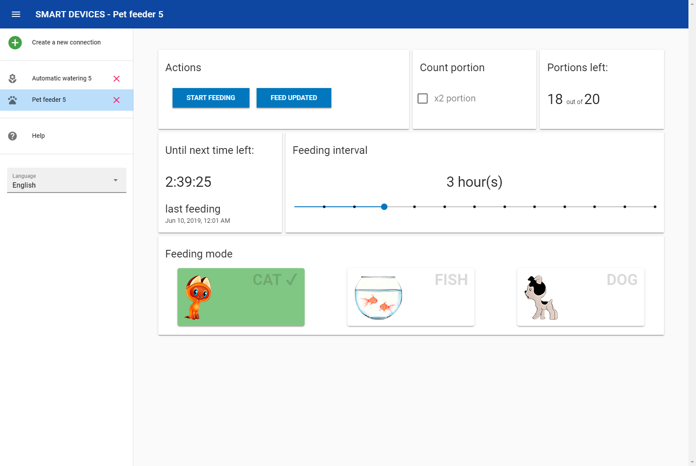
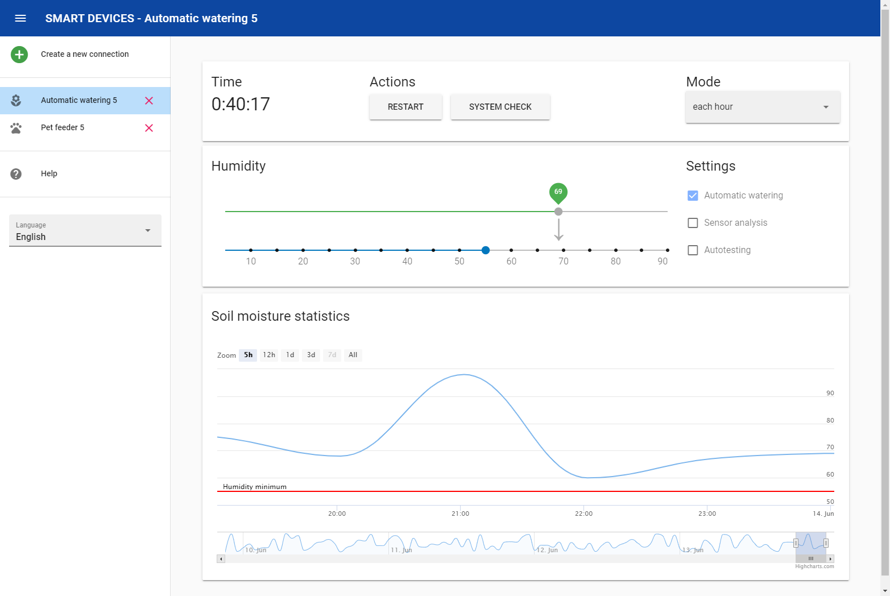

#  Frontend-smart-devices 

## Preview




## Getting started
**Installation**
```
npm install
cd client
npm install
```

**Activation**
### Test servers (fake devices)
```
npm run aw/pf [port]
```

### Compiles and hot-reloads for development
```
npm run serve
```

### Compiles and minifies for production
```
npm run build
```

## Contributing
Please read [CONTRIBUTING.md](https://github.com/TODO_NAME/Frontend-smart-devices/CONTRIBUTING.md) for details on our code of conduct, and the process for submitting pull requests to us.

## Authors
 * Nikita Stroganov - Initial work

## License
[MIT](https://github.com/TODO_NAME/Frontend-smart-devices/LICENSE.md). Copyright (c) TODO_NAME.
